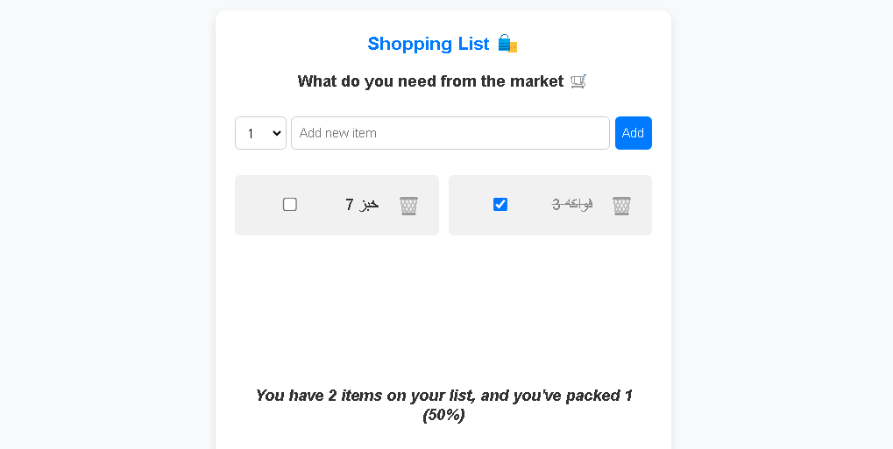
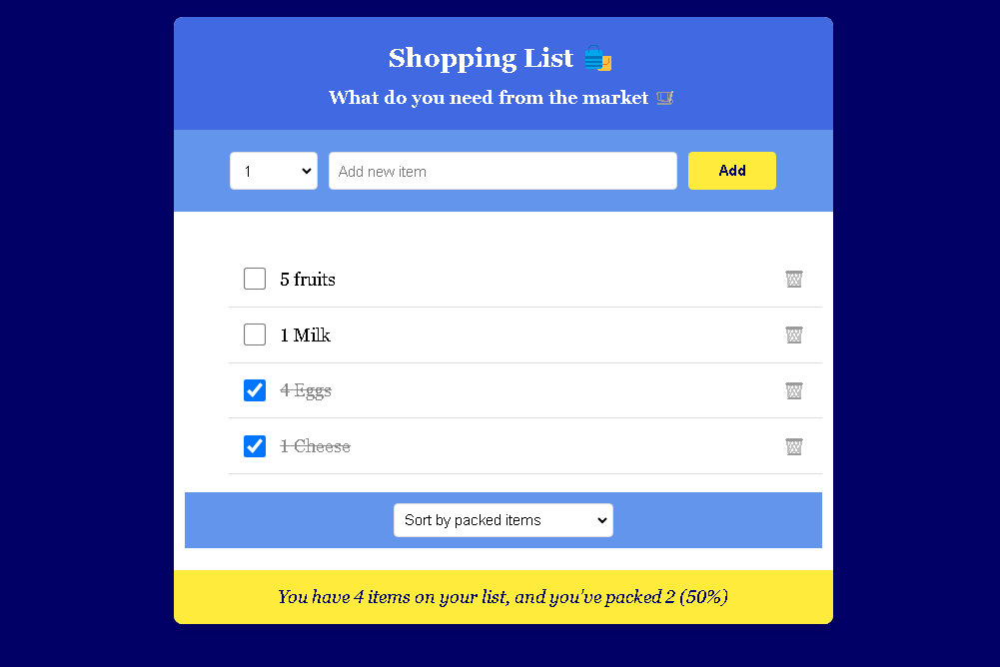

<!-- # Shopping List Application

## Overview
A React-based shopping list application that helps users manage their shopping items with features like adding, removing, marking items as packed, and sorting capabilities.

## Versions

### Version 1 (V1)


#### Features
- Add items with quantity
- Remove items
- Mark items as packed/unpacked
- Basic statistics display
- Simple blue and yellow color scheme

#### Components
1. **App**: Main container component
   - Manages the items state
   - Handles add, remove, and toggle functionality

2. **Logo**: Header component
   - Displays application title and subtitle
   - Styled with basic center alignment

3. **Form**: Input component
   - Quantity selector (1-15)
   - Text input for item description
   - Add button

4. **List**: Items display component
   - Renders individual items
   - Basic list layout

5. **Item**: Individual item component
   - Checkbox for packed status
   - Item description with quantity
   - Delete button

6. **States**: Statistics component
   - Shows total items count
   - Displays packed items percentage
   - Success message when all items are packed

### Version 2 (V2)


#### New Features & Improvements

1. **Enhanced Styling**
- Dark blue background theme (#000066)
- Royal blue header sections (#4169E1)
- Cornflower blue form areas (#6495ED)
- Yellow accents for interactive elements (#FFEB3B)
- Improved responsive design
- Better visual hierarchy

2. **New Sorting Functionality**
The List component now includes sorting capabilities:
```javascript
const [sort, setSort] = useState("input");
let sortedItems = [...items];

if (sort === "description") {
    sortedItems.sort((a, b) => a.description.localeCompare(b.description));
} else if (sort === "packed") {
    sortedItems.sort((a, b) => Number(a.packed) - Number(b.packed));
}
```

Sorting options:
- By input order (default)
- Alphabetically by name
- By packed status

3. **Responsive Improvements**
- Flexible container widths
- Dynamic font sizing
- Mobile-optimized touch targets
- Improved form element layout
- Better text wrapping

## Technical Implementation

### State Management
- Uses React's useState hook for state management
- Implements lifting state up pattern for shared state
- Maintains immutable state updates

## Usage

1. Add items:
   - Select quantity (1-15)
   - Enter item description
   - Click "Add" button

2. Manage items:
   - Check/uncheck to mark as packed
   - Click trash icon to remove items
   - Use sort dropdown to organize items

3. Track progress:
   - View total items count
   - Monitor packing progress percentage
   - See completion message when all items are packed

## Component Structure
```
App
├── Logo
├── Form
├── List
│   └── Item
└── States
```

## Future Improvements
1. Local storage persistence
2. Categories for items
3. Multiple shopping lists
4. Share list functionality
5. Print/export feature

## Contributing
Contributions are welcome!. -->